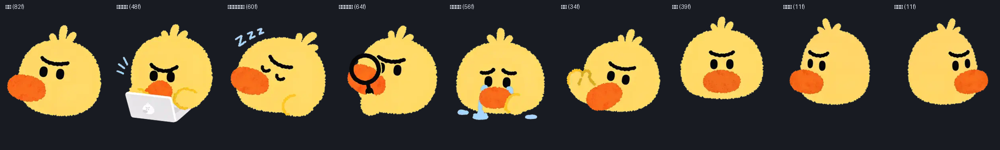

# dsh-qoduck-pet

把 [Qoder](https://qoder.com) 的 **Qoduck** 做成 DeepSeek Harness 的**桌面宠物**。

不是网页里的浮层——是一个独立于浏览器的桌面窗口：透明、无边框、置顶、不占任务栏。
关掉网页它还在，可以拖到桌面任何位置。姿态随 Agent 状态切换，指针靠近时会转头看你。



## 为什么窗口要插件自己带

查过平台之后的结论，不是猜的：

| 事实 | 依据 |
|---|---|
| DSH 的 Electron 外壳只当容器 | `app.asar/lib/package.json` → `@deepseek-ai/dsh-desktop`，main `lib/main.js` |
| 真正跑 Cordis 的是**子进程** | `lib/main.js` 里 `desktopNodeEnvironment()` 设 `ELECTRON_RUN_AS_NODE: "1"`，再 `spawn()` 出 `@deepseek-ai/dsh-desktop-host` |
| 插件拿不到窗口 API | 探针实测：宿主进程 `process.versions.electron = 44.0.0`，但 `BrowserWindow` 为 `false`、`process.type` 为 `null` |
| DSH 没有窗口服务 | 官方可加载包清单（512 行）里没有窗口/托盘/桌面类包；`dsh --profile desktop --dump-config` 被拒（"managed exclusively by the Electron application"） |

所以窗口走 **PowerShell + WPF**：Windows 自带、零依赖、原生支持逐像素 alpha。

市场里的 `dsh-desktop-pet` 走的是另一条路——它自带一个 Tauri/Electron 应用，DSH 侧只有一个
**空壳** `dsh-plugin.mjs`（`export function apply() {}`），用户得另外装那个桌面应用。
本插件不需要额外安装任何东西。

## 结构

```
lib/index.js         宿主半部：进程托管 + 事件状态机 + HTTP 路由 + 活动卡片下发
lib/activity.js      活动卡片的数据面（按会话聚合，排活跃度）
lib/step-summary.js  对话活动摘要：移植 DSH 客户端的类别判定与标题拼装
lib/pet.ps1          WPF 窗口本体（动画、拖拽、注视、右键菜单、活动卡片）
lib/client.js        浏览器半部：只有设置页，不渲染宠物
assets/              41 个动画 WebP（原始素材）
frames/              12 张 spritesheet PNG + 16 张注视帧 + manifest.json
scripts/build-frames.py    WebP → spritesheet 转换器
scripts/asar.py            只读 asar 解析器（查证 DSH 实现用）
scripts/smoke-test.mjs     离线冒烟测试
```

## 状态机

宿主侧直接订阅 Cordis 事件，不经过浏览器：

| 事件 | 作用 |
|---|---|
| `agent/status` | `running` 进集合；转 `idle` 记回合结束时间 |
| `agent/error` | 记错误时间戳 |
| `tools/execute` | waterfall 包住派发，进出计数（必须 `next()`） |
| `approval/request` | 等待用户（waterfall，必须 `next()`） |
| `user-questions/request` | 同上 |
| `agent/turn-stopping` | 回合即将关闭 |

优先级与 Qoder 原版一致：

| 条件 | 姿态 |
|---|---|
| 错误 < 6s | `failed` 执行受阻 |
| 等待计数 > 0 | `waiting` 需要你的操作 |
| 工具执行中 | `running` 正在工作 |
| Agent 运行中 | `running` 正在工作 |
| 回合结束 < 4s | `review` 结果可查看 |
| 其余 | `idle` 空闲 |

`failed` / `review` 是瞬时姿态，有一个 1s 的巡检把它们按时回落，不用等下一个事件。

## 交互

| 操作 | 行为 |
|---|---|
| 拖拽 | 移动窗口；横向拖动时切左右跑动画；松手落位并持久化 |
| 单击 | 不做动作（招手只属于开窗问候与待机随机） |
| 双击 | 唤起 DSH 客户端主窗口（不是打开网页），并跳一下作为反馈 |
| 鼠标悬停到宠物上 | **反复播放**跳跃，直到移开 |
| 打开窗口时 | 先挥一次手打招呼 |
| 待机时 | 保持 `idle` / `idleEye`；每 30–75s 随机招手一次，不再自动左右张望 |
| 指针在宠物周围半径 200 DIP 的圆形内移动 | 16 向注视跟随；光标静止后回落到当前相位动画 |
| 指针落在宠物自身范围内 | **完全不触发注视**（贴身转头会在左右之间抽搐，已移除该机制） |
| 指针超出半径 200 DIP 的圆形 | 完全不跟随——不是全屏跟随 |
| 右键 | 菜单只有一项「关闭宠物」（关掉显示，设置页里可再打开） |

## 活动卡片

卡片贴在宠物上方，与宠物一起水平居中。**图标列与文字列各自对齐**：蓝点和活动图标同处第 0 列且都靠左，
两行文字同处第 1 列、左边距相同，因此四者左边成一条竖线。两行都是**单行 + 省略号**。

| 行 | 内容 |
|---|---|
| 第一行 | 会话标题（多会话时缀 `+N`） |
| 第二行 | 活动图标 + **实时信息**——此刻具体在干什么 |

第二行按下面优先级取值，目的是「焦点不在客户端时也能看出跑到哪一步了」：

| 优先级 | 条件 | 例子 |
|---|---|---|
| 1 | 有工具在跑 | `运行 pnpm test`、`读取 lib/pet.ps1`、`搜索 TODO`、`搜索网页 今天的AI新闻` |
| 2 | 模型在生成 | 实时的推理末段（`agent/assistant-stream` 的 `reasoning-delta`） |
| 3 | 都没有 | 聚合摘要，如 `修改了文件，已读取文件，执行了命令等` |

第 3 档只作兜底：单说「修改了文件」等于什么都没说，所以只要拿得到更具体的信息就不用它。

### 右侧按钮的三态

同一个按钮承担三种含义，颜色与图形一起变：

| 状态 | 图形 | 颜色 | 可点击 |
|---|---|---|---|
| 有任务在跑 | 方块 | 红 `#E5534B` | 是（点击停止该会话） |
| 已完成、未读 | 对号 | 绿 `#3FB950` | 否 |
| 已读过 | 暂停 | 灰 `#6E6E73` | 否 |

双击宠物唤起客户端即视为「已读」；新一轮任务开始（状态回到 `running`）时自动清掉已读标记。

**没有任何会话在跑超过 4 分钟**（`CardAutoHideMs`）时卡片自动收起，等下次有任务运行再弹出。
宿主侧条目的保留时长是 6 分钟（`SETTLE_HOLD_MS`），刻意比收起阈值长，避免「卡片还开着但数据已被丢弃」的闪断。

### 实时信息从哪来

| 来源 | 给什么 |
|---|---|
| `agent/assistant-stream` | 最细的实时源：`reasoning-delta` / `text-delta` / `block-end`（含完整参数的 tool-call）。按 token 推，所以宿主侧限流到 400ms 一次落盘 |
| `session/event` | 提交后的 `turn/start`、`tool/call`、`tool/result`、`assistant/message` |
| `tools/execute` | 工具派发（驱动宠物姿态） |

### 类别判定与聚合文案为什么要自己算

「已完成分析」「修改了文件」这类文案**只存在于 `@deepseek-ai/dsh-client-ui-chat/lib/client.js`**（浏览器侧），
宿主不提供这个服务，独立进程的桌宠窗口更拿不到。所以 `lib/step-summary.js` 把客户端那套算法照搬了过来：

| 移植来源 | 位置 | 作用 |
|---|---|---|
| `activity(name)` | client.js:485220 | 工具名 → 14 个类别之一 |
| `processActivity(nodes)` | client.js:488954 | 按「次数降序、同次数先出现者在前」排名 |
| `processTitle(summary)` | client.js:123404 | 取前三类拼标题，类别总数 >3 时补「等」 |
| `liveToolDetail` | client.js:488126 | 按 22 个键的固定优先级从参数里取一行明细 |
| `liveReasoningDetail` | client.js:487379 | 倒着找第一段非空推理文本，去掉 `**` |
| `PROCESS_ICONS` | client.js:139538 | 类别 → 图标（桌宠用自绘矢量路径对应） |

`processTitle` 的三条分支逐字对齐：一类直出；两类用「并」，两边都以「已」开头时省掉第二个的前缀
（`已读取文件` + `已读取图片` → `已读取文件并读取图片`）；三类及以上用「，」连接。

### 卡片配色

桌宠是独立 WPF 进程，读不到 DSH Web 的主题 token（那是浏览器里的 CSS 变量），
因此卡片自带一套配色，并跟随**桌面**的亮暗模式——取自注册表
`HKCU\Software\Microsoft\Windows\CurrentVersion\Themes\Personalize\AppsUseLightTheme`，
每 5s 复查一次，用户在系统设置里切换后会跟上。状态点与右侧三态按钮是语义色（蓝/橙/绿/红/灰），不随亮暗变。

## 姿态与动画的对应

| 相位 | 动画 | 触发 |
|---|---|---|
| `idle` | `idle` → 停留 2 个周期后 `idleEye` | 状态机 |
| `running` | `running` | `agent/status` running、`tools/execute` |
| `waiting` | `waiting` | `approval/request`、`user-questions/request` |
| `review` | `review` | `turn/end` reason `completed` |
| `failed` | `failed` | `agent/error`、`turn/end` reason `error` |
| `interrupted` | `failed`（别名） | `turn/end` reason `aborted`+`user` 或 `interrupted` |
| — | `waving` / `jumping` | 开窗 / 待机随机招手 / 双击 / 悬停 |
| — | `runningLeft` / `runningRight` | 拖拽方向 |
| — | `look-000` … `look-337_5`（16 帧） | 指针在注视范围内移动 |

12 个动画素材均保留；`lookLeft` / `lookRight` 不再接入任何待机调度，避免循环转头造成抽搐。

## 配置

落盘在 `${DSH_HOME:-~/.dsh}/qoduck-pet/`：

| 文件 | 内容 |
|---|---|
| `config.json` | 用户配置（由设置页读写） |
| `state.json` | 宿主写给窗口的姿态与配置快照 |
| `activity.json` | 宿主写给窗口的活动卡片快照（含两行文案与图标名） |
| `action.json` | 窗口写给宿主的动作（停止 / 回复 / 关闭宠物），宿主轮询消费后删除 |
| `window.json` | 窗口自己维护的位置/尺寸/卡片展开态 |
| `pet.log` | 窗口进程的 stderr |

设置页在 **设置 → Qoduck 桌宠**：开关、尺寸（48–384，默认 84）、鼠标注视、活动卡片、
停靠角、重置位置，以及当前姿态与窗口进程状态。

## 安装

```bash
dsh plugin --profile desktop add /path/to/dsh-qoduck-pet
```

或让 Agent 用 `plugin_manager` 的 `install_bundle` 指向包目录——它自己完成装包与 bundle 注册。
不要手改 profile 的 `package.json` / `cordis.patch.yml`，也不要在 profile 目录里跑 pnpm。

## 测试

```bash
node scripts/smoke-test.mjs
```

在插件根目录执行上述命令；若 `node` 不在 `PATH`，可改用 DSH 内置运行时的 `node.exe` 执行同一脚本。

覆盖：配置收敛与落盘、状态机全分支与运行集合 `Set` 计数、作用域事件的 `global` 订阅形状、路由形状、素材路径穿越拒绝、进程托管不误启、
**pet.ps1 的 UTF-8 BOM**、DPI 感知与坐标口径、注视静止回落/相位白名单/圆形范围、**单元格整除（最后一行越界回归）**、
帧表完整性、以及浏览器半部**不含任何页内浮层或 DOM 直写**。

## 三个踩过的坑（已固化成测试）

1. **pet.ps1 必须有 UTF-8 BOM。** PowerShell 5.1 按 ANSI 读无 BOM 文件，中文注释会
   被解码错乱成非法 token，直接解析失败。用会剥离 BOM 的编辑器改完必须补回来。
2. **单元格尺寸要按解码后的表整除，不能按缩放比各自四舍五入。**
   `DecodePixelWidth` 会独立取整表高，两边分别 `round` 会让最后一行越界
   （11 × 208 = 2288 > 实际表高 2285），`CroppedBitmap` 抛「值不在预期的范围内」。
   动画跑到最后一行的帧才触发，所以短测试发现不了。
3. **DPI 口径不能混。** 进程声明 DPI 感知后，WPF 用 DIP 而 WinForms 的 `Screen`/`Cursor`
   返回物理像素；混用会把窗口算到屏幕外（实测 150% 缩放下 3840 物理宽被当成 3840 DIP）。
   内部统一用 DIP，只在读光标时换算一次。

## 内存

12 张 spritesheet 全部按原尺寸解码约 143 MB（idle 单张 23.8 MB）。窗口侧按**显示尺寸**
解码（`DecodePixelWidth`）并懒加载，缓存只保留 idle 与当前动画两张，实测常驻在几十 MB 量级。

## 素材来源与授权

素材提取自本机安装的 `Qoder CN 0.4.3`（`D:\Program\Qoder CN\resources\app.asar`），
版权归 Qoder 所有。本插件仅作个人研究与本地使用，未获授权再分发。
对外发布前请先确认授权，或替换为自有素材。
